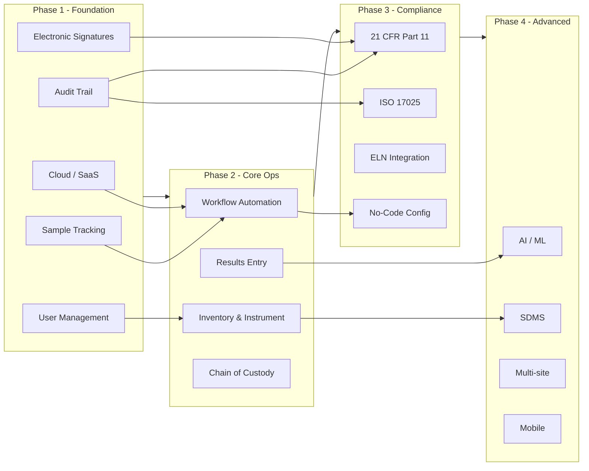
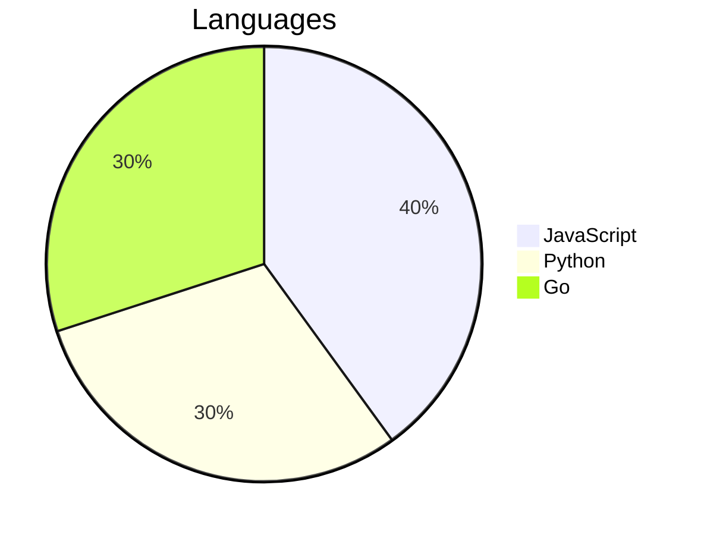

# Test Mermaid Diagram

This is a test document with a mermaid diagram.

```mermaid
flowchart LR
  subgraph P1[Phase 1 - Foundation]
    direction TB
    A1[Sample Tracking]
    A2[User Management]
    A3[Cloud / SaaS]
    A4[Audit Trail]
    A5[Electronic Signatures]
  end
  subgraph P2[Phase 2 - Core Ops]
    direction TB
    B1[Workflow Automation]
    B2[Inventory & Instrument]
    B3[Results Entry]
    B4[Chain of Custody]
  end
  subgraph P3[Phase 3 - Compliance]
    direction TB
    C1[21 CFR Part 11]
    C2[ISO 17025]
    C3[ELN Integration]
    C4[No-Code Config]
  end
  subgraph P4[Phase 4 - Advanced]
    direction TB
    D1[AI / ML]
    D2[SDMS]
    D3[Multi-site]
    D4[Mobile]
  end
  P1 --> P2 --> P3 --> P4
  A1 --> B1
  A2 --> B2
  A3 --> B1
  A4 --> C1
  A4 --> C2
  A5 --> C1
  B1 --> C4
  B2 --> D2
  B3 --> D1
```

And another simple diagram:

```mermaid
pie title Languages
  "JavaScript" : 40
  "Python" : 30
  "Go" : 30
```
