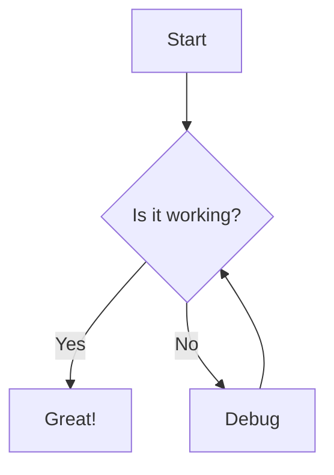
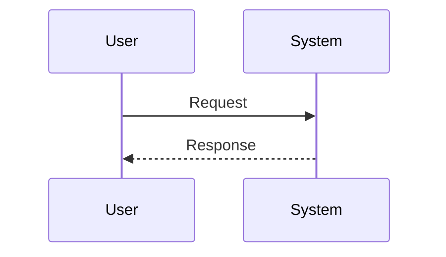
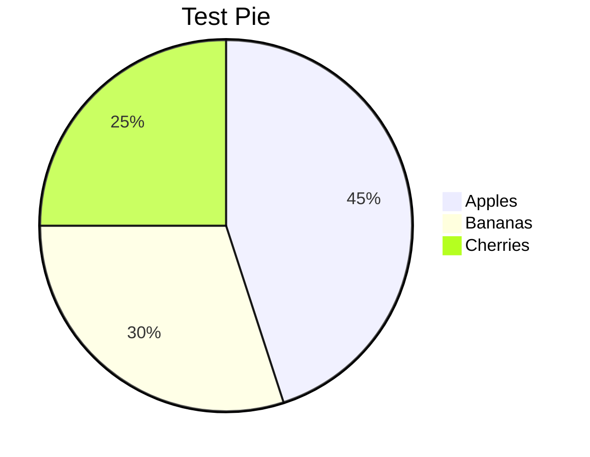
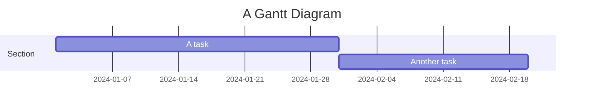
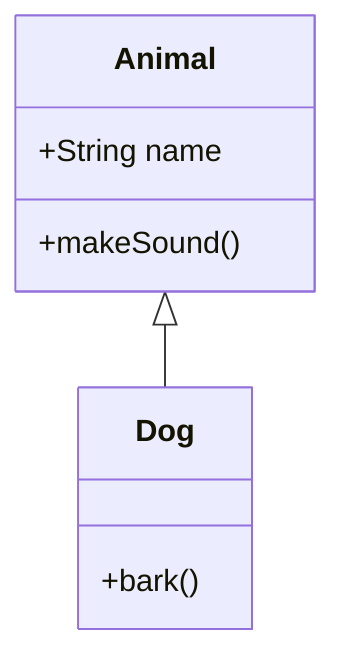
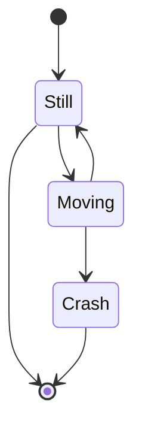
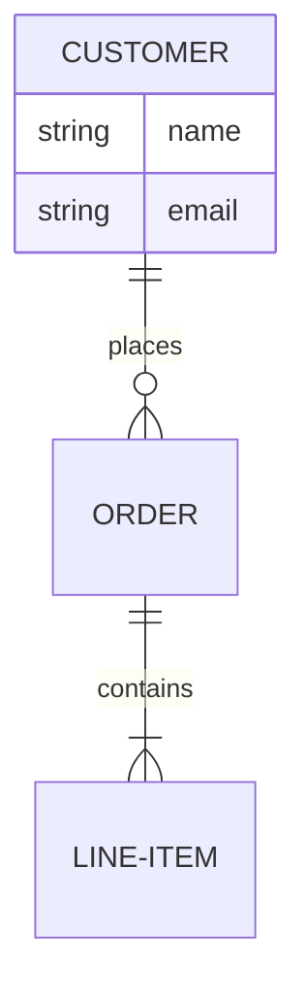
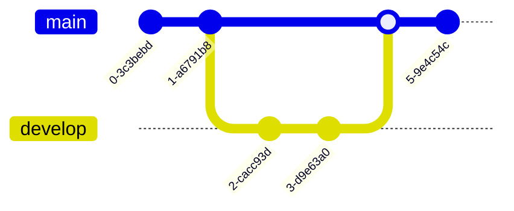
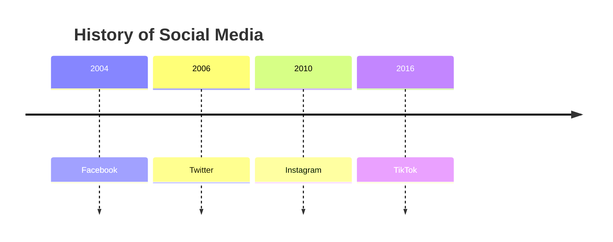

# Mermaid Diagram Test

## Flowchart


## Sequence Diagram


## Pie Chart


## Gantt


## Class Diagram


## State Diagram


## Entity Relationship


## Gitgraph


## Timeline


## Mindmap
```mermaid
mindmap
    root((Mindmap))
        Origins
            Long history
        Popularisation
            British popular psychology
